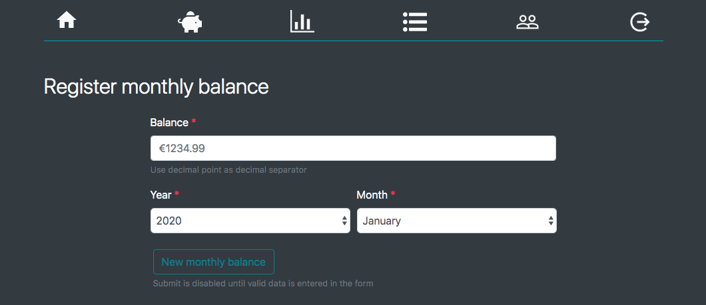
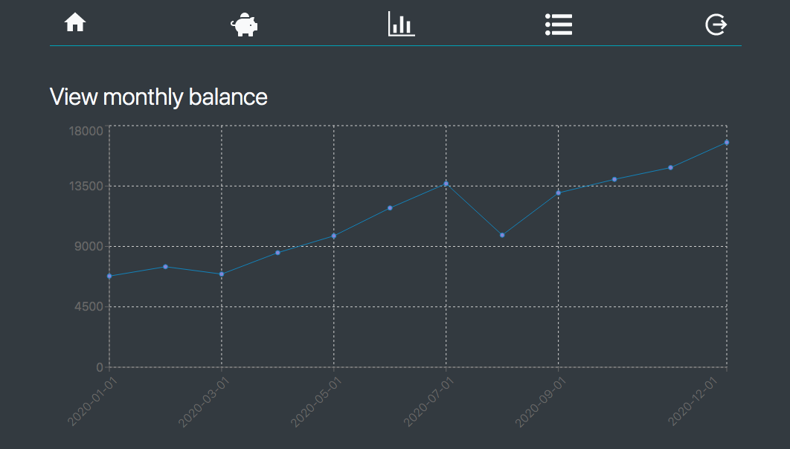
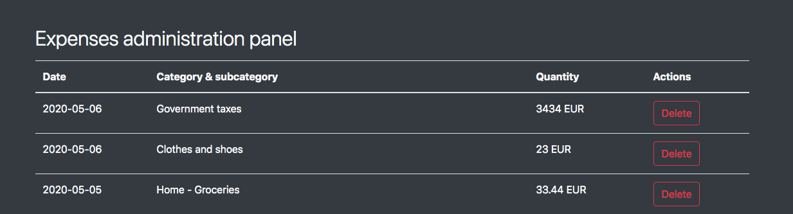

# 💰 didibudget-frontend

This is an app to manage your money.
The proyect is splitted on two repositories: one for the backend and one for the frontend application.

This repository is for the frontend and is intended to work with [the backend](https://github.com/didaquis/didibudget-backend)

  

  

  

### 📝 Frontend Requirements
* Backend must be running
* Node.js 10 or higher (just for development)

### 📚 How to run the application?
* Use the command: `npm install`.
* Configure the application:
  * Duplicate the configuration file `_env` and rename it as `.env`
  * Edit the file `.env`
* Then use: `npm run start`. 

### 🚀 How to deploy?
* Use the command: `npm install --production`.
* Make sure you have the correct enviroment vars configuration on the `.env` file.
* Then use `npm run build` to create a production bundle. This bundle will be created in the `./build` folder.
* The content of `./build` folder is ready to be deployed to production.

**Do you need help with `.env` file?** 

Don't worry, here you have a guide:

| Key | Description |
|-----|-------------|
| REACT_APP_PROTOCOL | Protocol to communicate with backend. Set http or https |
| REACT_APP_HOST | Host of backend. An IP or domain |
| REACT_APP_PORT | Port of backend |
| REACT_APP_GRAPHQL | Endpoint of GraphQL API |

### 💻 Tricks for development
* Run app in dev mode: `npm run start`
* Run the linter: `npm run lint`
* Run the test: `npm run test`

